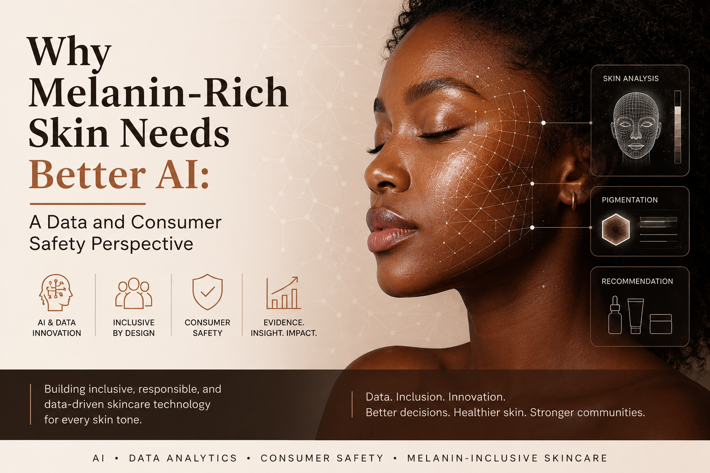

# Why Melanin-Rich Skin Needs Better AI: A Data and Consumer Safety Perspective

## Project Overview

This repository supports my published Medium article, **“Why Melanin-Rich Skin Needs Better AI: A Data and Consumer Safety Perspective.”**

The article explores the importance of inclusive artificial intelligence in skincare and consumer decision-support systems, especially for melanin-rich skin. It highlights how data imbalance, limited representation, and poorly designed AI tools can affect fairness, safety, and consumer trust in beauty and skincare technology.

This work forms part of my broader professional interest in the intersection of **data analytics, artificial intelligence, consumer safety, inclusive skincare innovation, and non-clinical consumer decision-support tools**.

**Read the full article on Medium:**
[https://medium.com/@chidinmac.igwe5/why-melanin-rich-skin-needs-better-ai-a-data-and-consumer-safety-perspective-c5d811265f75](https://medium.com/@chidinmac.igwe5/why-melanin-rich-skin-needs-better-ai-a-data-and-consumer-safety-perspective-c5d811265f75)

## Why This Topic Matters

Artificial intelligence is increasingly being used in beauty, skincare, wellness, and consumer health. However, AI tools are only as reliable as the data used to train them.

In skin-related technology, underrepresentation of darker skin tones can create gaps in model performance, product recommendations, and consumer guidance. For melanin-rich consumers, concerns such as hyperpigmentation, acne marks, uneven tone, irritation, dryness, and sensitivity may present differently and require more inclusive technology design.

This project focuses on the need for AI systems that are:

* More inclusive of diverse skin tones
* More transparent in their limitations
* Safer for consumer use
* Supported by better-quality data
* Designed to assist, not replace, qualified professionals

## Key Themes

### 1. Data Representation

AI models depend on training data. If datasets do not adequately represent melanin-rich skin, model outputs may be less reliable for darker skin tones.

### 2. Consumer Safety

Skincare AI tools must be designed responsibly. Poor recommendations or overconfident outputs can lead consumers to misuse products, combine harsh ingredients incorrectly, or delay seeking professional advice when needed.

### 3. Non-Clinical Decision-Support

The purpose of responsible skincare AI should not be to diagnose or treat medical conditions. Instead, these tools should support general consumer education, skincare awareness, product understanding, and safer decision-making.

### 4. Inclusive Skincare Innovation

Inclusive technology should be built with melanin-rich users in mind from the beginning. Representation should not be an afterthought.

## My Perspective

As a data analyst and beauty-tech founder, I am interested in how data, AI, and inclusive product innovation can be used to solve real consumer problems.

My work focuses on building responsible, non-clinical consumer decision-support concepts that help users better understand skincare concerns, ingredient suitability, and product choices while respecting the role of qualified healthcare and dermatology professionals.

This project contributes to my wider innovation focus around melanin-inclusive skincare, AI-supported consumer tools, and safer digital experiences for diverse consumers.

## Skills Demonstrated

This project demonstrates the following skills and knowledge areas:

* Data analytics and problem framing
* AI ethics and fairness awareness
* Consumer safety analysis
* Inclusive product innovation
* Skincare technology research
* Public communication and thought leadership
* Non-clinical decision-support positioning
* Digital health and beauty-tech strategy

## Relevance to My Portfolio

This publication is part of my broader professional portfolio connecting:

* Artificial Intelligence
* Data Analytics
* Consumer Safety
* Inclusive Skincare
* Beauty Technology
* Melanin-Rich Skin Representation
* Responsible Digital Innovation

It supports my long-term goal of developing inclusive, data-informed skincare and consumer decision-support tools that help consumers make safer and more informed choices.

## Suggested Future Work

Potential next steps include:

* Building a small Power BI dashboard showing skin-tone representation gaps in sample datasets
* Creating a Python notebook exploring class imbalance in dermatology image datasets
* Developing a non-clinical skincare decision-support prototype
* Publishing further articles on AI bias, consumer safety, and inclusive beauty technology
* Creating a public portfolio page linking Medium, GitHub, and project documentation

## Disclaimer

This project is for educational, research, and portfolio purposes only. It does not provide medical advice, diagnosis, or treatment. Any skin health concerns should be discussed with a qualified healthcare or dermatology professional.

## Author

**Chidinma Charity Igwe**
Data Analyst | AI & Consumer Safety Enthusiast | Beauty-Tech Founder
Founder, NmaCharis LLC
